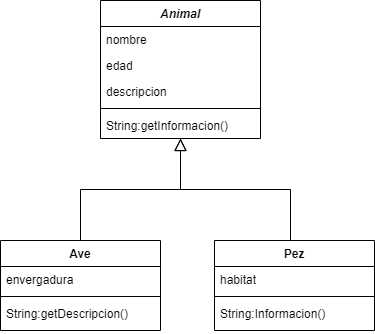

#Ejemplo de Clases e Importación de Módulos

En el siguiente proyecto, se puede observar el manejo de clases dentro de JavaScript. Podemos observar que existe la clase **"Animal"**, que podríamos considerar como la clase padre, y las clases **"Ave"** y **"Pez"**, que heredan los atributos de nombre y edad.

Cabe mencionar que, para acceder a una función o variable que se encuentra en la clase padre, se utiliza la función **super(...)**.

## Diagrama de clases

## Cómo Usar

1. Instala las dependencias.
2. Ejecuta el comando `npm start`.

